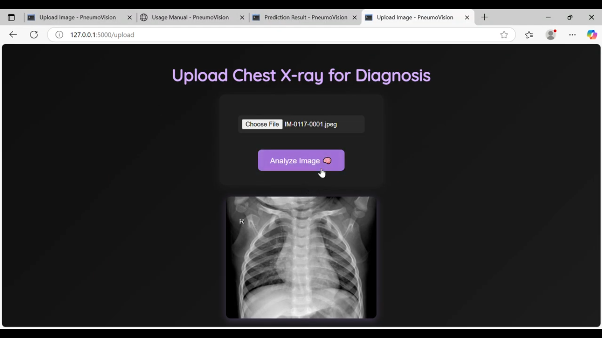

# AI-Based Pneumonia Detection Using Chest X-ray Images

## Project Overview
This project is a web-based application that detects pneumonia from chest X-ray images using a Convolutional Neural Network (CNN). The system allows users to log in, upload a chest X-ray image, and receive a prediction indicating whether pneumonia is present or not.

## Features
- User login system
- Upload chest X-ray image
- Image preprocessing
- CNN model prediction
- Result displayed as Pneumonia or Normal
- Web-based interface using Flask

## Technologies Used
- Python
- TensorFlow / Keras
- Flask
- HTML, CSS
- NumPy
- Pandas
- OpenCV

## Model Information
- Model Type: Convolutional Neural Network (CNN)
- Classification Type: Binary Classification
- Classes: Pneumonia / Normal
- Accuracy: 92.3%

## Screenshots

### Home Page

### Login Page

### Upload Page

### Result – Normal

### Result – Pneumonia

## Demo Video
Watch the project demo here:
[click to watch demo video]
https://drive.google.com/file/d/1Gg_frz7g5dpo8sNOqamRbs6lpwvn1xOr/view?usp=drivesdk
